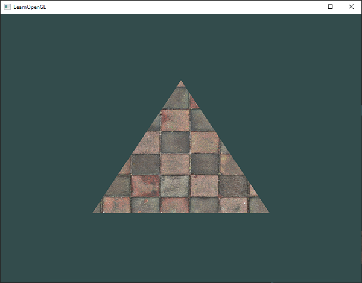
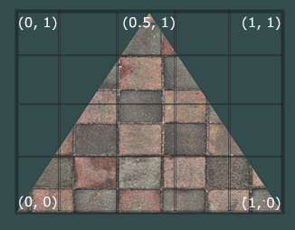
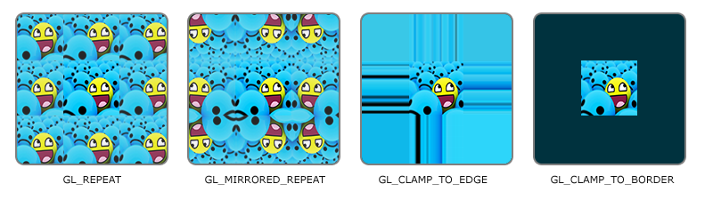
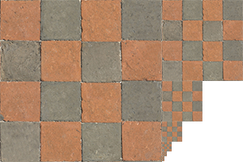
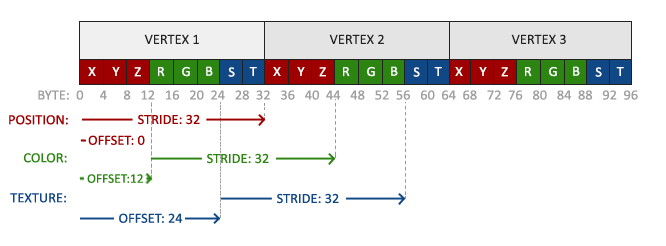
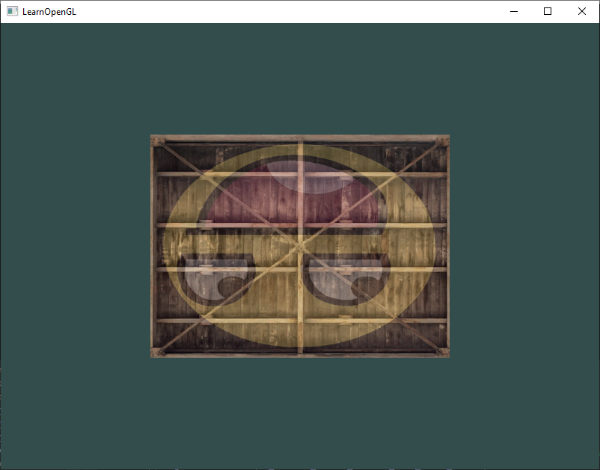
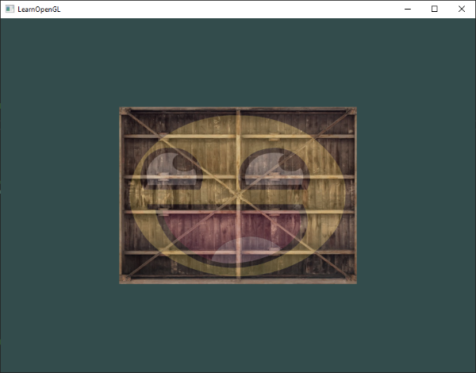

# 텍스처
텍스처라는것은 일반적으로 2D이미지인데, 이것을 오브젝트에 씌우면 오브젝트의 겉모습과 무늬가 쉽게 변한다.



우리가 그린 삼각형에 텍스쳐를 입힌 모습인데, 다음과 같은 결과를 위해선 삼각형의 각 정점이 텍스처의 어느 부분에 해당하는지를 아는 것이 중요하다.
texture coordinate(텍스처 좌표)와 매핑하는것이다.텍스처 좌표는 (u, v)로 나타내며, 보통 0.0 ~ 1.0 사이의 정규화된 값을 사용한다.(*아래 사진*)



이 삼각형을 예로들어보자면,
```
- 삼각형의 왼쪽하단을 텍스처 좌표에서 (0,0)
- 오른쪽 하단을 텍스처 좌표에서 (1,0)
- 가운데 위를 텍스처 좌표에서 (0.5, 1)
```
---
이렇게 나온 텍스처좌표를 vertex shader에 전달하면 v.s는 이를 f.s로 전달하여 선택받지 못한 (3점을 제외한 나머지) 픽셀의 위치는 텍스처에선 어디 좌표인지 보간하여 처리한다.

텍스처 좌표의 범위는 (0,0) ~ (1,1) 라고 하였다. 만일 ***이 범위를 벗어나면*** 처리할 수 있는 방식은 크게 4가지이다. 

 
4가지를 통틀어 **텍스처 래핑 모드(Texture Wrapping Mode)** 라고 한다.

```
1. GL_REPEAT : 텍스처 이미지를 반복함
   
2. GL_MIRRORED_REPEAT : 반복시 거울처럼 이미지가 반전됨

3. GL_CLAMP_TO_EDGE : 텍스처의 가장자리 색상을 사용하여 값을 채우는 방식. (텍스처 좌표가 0.0보다 작을 경우 → 0.0에 해당하는 가장자리 색상 사용 & 텍스처 좌표가 1.0보다 클 경우 → 1.0에 해당하는 가장자리 색상 사용)
   
4. GL_CLAMP_TO_BORDER : 범위를 벗어난 좌표는 사용자가 지정한 색으로 처리해버림.
```

위 4가지의 래핑모드는 함수 glTexParameter함수를 사용해서 하나씩 설정 할 수 있다. 텍스처가 2D 이면 s,t(x = s ,y = t, r도 있는데 이는 3D 텍스처에서 정의되면 z값과 같다.)

```cpp
glTexParameteri(GL_TEXTURE_2D, GL_TEXTURE_WRAP_S, GL_MIRRORED_REPEAT);
glTexParameteri(GL_TEXTURE_2D, GL_TEXTURE_WRAP_T, GL_MIRRORED_REPEAT);
```

만일 GL_CLAMP_TO_BORDER모드라면 , 좌표를 벗어난 부분의 경계색도 지정해야하므로, 매개변수가 하나 더 있는 함수 ***glTexParameterfv*** 라는 비슷한 함수를 써서  GL_TEXTURE_BORDER_COLOR 옵션으로 float값을 넘겨주어야 한다.

```cpp
float borderColor[] = { 1.0f, 1.0f, 0.0f, 1.0f };
glTexParameterfv(GL_TEXTURE_2D, GL_TEXTURE_BORDER_COLOR, borderColor); //경계색인자(GL_TEXTURE_BORDER_COLOR) 추가
```

---

# 텍스처 필터링(Texture Filtering)
만일 삼각형이 텍스처보다 훨씬 크다면, 텍스처를 입혔을때, 해상도가 깨진 상태가 될 것이다. 그걸 극복하기 위해서 Texture Filtering기술로 이를 보완할 수 있다.  ***텍스처 필터링(Texture Filtering)*** 이란  텍스처 샘플링 중에 픽셀 크기와 텍스처 좌표가 일치하지 않을 때 부드러운 결과를 생성하기 위해 사용하는 기법을 의미한다. 

텍스처는 ***텍셀(texel)*** 이라는 기본 픽셀단위로 구성되는데, 텍셀은 텍스처와 화면에 대응되도록 하는 텍스처상의 픽셀을 의미한다.  

filtering은 그 방식이 굉장히 많은데 여기서는 대표적으로 ***GL_NEAREST***, ***GL_LINEAR*** 가 있다.

## 필터링 첫번째 - GL_NEARST
  
GL_NEAREST는 opengl에서 기본으로 적용하는 filtering으로,GL_NEAREST는 texture 좌표가 있으면 이 위치에서 가장 가까운 texel을 선택해서 적용한다. 아래 그림을 보면 texture 좌표는 왼쪽 위 texel의 중심과 가장 가깝기 때문에 이걸로 sampling해서 색을 정하게 된다.


## 필터링 두번째 - GL_LINEAR
  
GL_LINEAR방식은 텍스처 좌표가 있고 그 좌표값에 인접한 텍셀들에 대해서 가까운 만큼 (비율에 맞게)혼합적으로 보간을 해줘서 최종 텍셀을 생성한다.


  
필터링 방식에따라 픽셀이 두드러질 수도있고, 부드러워질 수 있다..

```cpp
glTexParameteri(GL_TEXTURE_2D, GL_TEXTURE_MIN_FILTER, GL_NEAREST);
glTexParameteri(GL_TEXTURE_2D, GL_TEXTURE_MAG_FILTER, GL_LINEAR);
```

위 코드는 텍스처 필터링이 확대되거나 축소되는 경우 어떤 방식으로 필터링지 결정할 수 있음을 보여준다. 첫 라인은 텍스처가 축소될 때 가장 가까운 텍셀 하나만 샘플링하는 GL_NEAREST 방식, 두 번쨰 라인은 확대될 때 주변 텍셀값들에 선형 보간을 적용한 GL_LINEAR 방식을 사용한다.


# 밉맵(Mipmap)
우리가 오브젝트에 텍스처를 입혔다고 해보자. 가까이 있건 멀리있건 계속 고해상도 상태로 유지된다면, 멀리있을 때는 텍스처를 구체적으로 표현할 이유가 없기도하고 메모리 낭비이기 때문에 고해상도 텍스처가 될 필요가 없게 된다는것을 알 수있다.  
그래서 미리 기존의 텍스처이미지를 ***밉맵(Mipmap)*** 하는 방식을 사용한다.  밉맵은 ***텍스처 이미지를 여러 크기로 줄여서 저장해 놓은 것***으로, 대게 2배기준으로 작게 만들고 이를 따로 저장해 둔다.  

  
만약 texture가 적용되는 object까지의 거리가 특정 값 이상으로 넘어가면 거기에 알맞는 밉맵 텍스처를 적용시키는 것이다. 위 사진은 밉맵을 모아둔 한 예이다.

밉맵은 텍스처 하나하나마다 생성시키기 번거로우니, glGenerateMipmap함수를 써서 자동으로 밉맵을 생성할 수 있다.

그런데 이전에 설명했듯 텍스처의 크기가 늘어나거나 줄어들 때, ***텍스처 필터링(Texture Filtering)*** 을 할 수 있다고 하였다. 텍스처가 적용되는 거리가 특정값을 넘어가는 경우 텍스처가 사이즈가 변하게 될 텐데, 이때도 마찬가지로 필터링 기술을 적용할 수 있다. 이 역시 대표적으로 NEARST,LINEAR가 있고 ,옵션은 크게 4가지로 나뉜다.  
```
- GL_NEAREST_MIPMAP_NEAREST : 밉맵 중에서 픽셀 크기에 가장 가까운 하나를 고르고, 그 레벨에서 **가장 가까운 텍셀(근접 보간)**을 가져온다.
  
- GL_LINEAR_MIPMAP_NEAREST: 밉맵 중에서 픽셀 크기에 가장 가까운 하나를 고르고, 그 레벨에서 여러 텍셀을 선형 보간하여 값을 가져온다.
  
- GL_NEAREST_MIPMAP_LINEAR: 픽셀 크기에 가장 가까운 두 개의 밉맵을 고르고, 둘을 섞은 다음에 근접 보간으로 텍셀 값을 가져옴.
  
- GL_LINEAR_MIPMAP_LINEAR: 픽셀 크기에 가장 가까운 두 개의 밉맵을 고르고, 둘을 섞은 다음, 각각의 밉맵에서 선형 보간하여 값을 가져온다.
```
---

```cpp
glTexParameteri(GL_TEXTURE_2D, GL_TEXTURE_MIN_FILTER, GL_LINEAR_MIPMAP_LINEAR);
glTexParameteri(GL_TEXTURE_2D, GL_TEXTURE_MAG_FILTER, GL_LINEAR);
```
위 코드는 아까와 같은 함수(glTexParameteri)인데 ,필터링 방식이 위 4가지로 수정된 것 뿐이다.

# stb_image.h & C++ define (참고)

stb_image.h는 웬만한 이미지를 로드할 수 있는 라이브러리이다. 사용시 다음과 같은 코드를 입력한다.
```cpp
#define STB_IMAGE_IMPLEMENTATION
#include "stb_image.h"
```
#define은 라이브러리에서 특정 구현을 활성화할 때 자주 쓴다.  
예를 들어 stb_image.h에서 #define STB_IMAGE_IMPLEMENTATION은 함수 구현을 활성화하기 위해 사용한다.
```C
#ifdef STB_IMAGE_IMPLEMENTATION
// 실제 함수 구현 코드
unsigned char *stbi_load(const char *filename, int *x, int *y, int *comp, int req_comp) {
    // 이미지 로드하는 함수 구현
}
#endif
```

std_image.h는 일반적인 헤더파일과는 다르게 함수 선언뿐 아니라 구현부까지 넣어놓았다. 즉 define키워드를 내가 실행할 파일에서 사용해야 함수부분을 활성화시킬 수 있다는 것이다.  

단, 프로그램내에서 단 한번만 선언해야 한다. 프로그램을 만들 때 여러개의 실행파일들이 존재할 텐데, 그 파일들중 여러개는 stb_image.h의 함수를 사용하게 될 것이다. 그렇더라도 모든 파일말고 단 한개의 파일에서 한번의 선언만 하면 된다.  

여러번 define키워드로 활성화 시킬 경우, 동일 함수가 여러번 구현되어 오류가 나기 때문이다.
  

### 예시 (#define 키워드)
파일1. main.c
```c
#define STB_IMAGE_IMPLEMENTATION // 구현 활성화
#include "stb_image.h"           // 함수 구현 포함

int main() {
    // 프로그램의 메인 코드
    return 0;
}
```

파일2. other.c
```c
#define STB_IMAGE_IMPLEMENTATION // 또다시 구현 활성화
#include "stb_image.h"           // 함수 구현 포함
```
파일3. stb_image.h

```c
#ifdef STB_IMAGE_IMPLEMENTATION
// 예시 함수 정의
unsigned char *stbi_load(const char *filename, int *x, int *y, int *comp, int req_comp) {
    // 실제 구현 (간략화된 코드)
    return NULL;
}
#endif
```

위 상황같이 define을 2번 해버리면 중복활성화라서 오류가 난다는 것이다.
파일1 혹은 2 둘중 하나만 define해줘도 define하지 않은 다른 파일에서도 stb_image.h의 함수를 사용할 수 있다.

# 텍스처 시작

stb_image.h함수를 활성화 했다면 코드작성으로 텍스처 이미지를 사용하겠다는 표시를 해주어야 한다.

```cpp
int width, height, nrChannels;
unsigned char *data = stbi_load("container.jpg", &width, &height, &nrChannels, 0);
```  
폭,너비,색상 채널수를 선언하고, texture 이미지를 사용하기 위해 stbi_load함수를 사용한다. 선언했던 int들이 인자로 넘어간걸 볼 수있다.

### 텍스쳐 만들기
```cpp
unsigned int texture;
glGenTextures(1, &texture); //1개의 텍스처 오브젝트를 만들고 이 ID를 texture변수에 저장.
```  
이 코드는 마치 VAO만들었을 때랑 유사하다. 텍스처도 다른 오브젝트처럼 ID를 담아서 참조하는것이다. 결국 texture ID를 생성하는 코드.  
그리고 여느 오브젝트들이 그래왔듯 바인딩으로 활성화 시키고 그 활성화된 오브젝트를 조정한다.


```cpp
glBindTexture(GL_TEXTURE_2D, texture);

glTexImage2D(GL_TEXTURE_2D, 0, GL_RGB, width, height, 0, GL_RGB, GL_UNSIGNED_BYTE, data);
glGenerateMipmap(GL_TEXTURE_2D);
```

glTexImage2D는 텍스처 이미지를 생성하는 함수이다.

``` cpp
glTexImage2D(GL_TEXTURE_2D, 0, GL_RGB, width, height, 0, GL_RGB, GL_UNSIGNED_BYTE, data);
```
1 .텍스처 타겟 (첫 번째 인수) : 첫번째 인수는 어떤 종류의 텍스처를 생성할지 정하는 인수이다. GL_TEXTURE_2D를 쓴다면 2D텍스처를 사용하겠다는 뜻.

2 .Mipmap 레벨 (두 번째 인수) : 두번째 인수는 Mipmap은 텍스처의 여러 해상도 버전을 말한다. 이 인수는 어떤 Mipmap 레벨을 설정할지 지정합니다. 보통 기본 레벨인 0을 사용.

3 .텍스처 저장 형식 (세 번째 인수) : 세번째 인수는 OpenGL이 텍스처를 어떤 형식으로 저장할지 결정합니다. 예를 들어, 이미지가 RGB 값만 가지고 있다면, GL_RGB와 같은 형식을 사용합니다.

4-5 . 텍스처의 너비와 높이 (네 번째와 다섯 번째 인수) : 네번째 인수,다섯번째는 텍스처의 크기,높이를 지정합니다. 예를 들어, 256x256 픽셀의 텍스처를 생성하려면 너비와 높이를 각각 256으로 설정합니다.

6 . 레거시 요소 (여섯 번째 인수) : 여섯번째는 항상 0으로 설정합니다. 이는 과거의 호환성을 위해 남겨진 것입니다.

7-8 . 소스 이미지 형식과 데이터 유형 (일곱 번째와 여덟 번째 인수) : 7,8번째 인수들은 소스 이미지의 형식과 데이터 유형을 지정합니다. 예를 들어, 이미지가 RGB 형식이고 각 픽셀이 바이트(8비트)로 저장되어 있다면, GL_RGB와 GL_UNSIGNED_BYTE를 사용합니다.

9 .이미지 데이터 (마지막 인수) : 마지막 인수는 실제 이미지 데이터를 전달합니다. 이 데이터는 픽셀 값들의 배열로, 텍스처로 로드될 것입니다.

이렇게 glTexImage2D를 정상 호출했다면 텍스처 오브젝트(texuture)는 텍스처 이미지(data)를 갖게된다.
그리고 다음 라인에 glGenerateMipmap을 사용하면 필요한 모든 밉맵이 생성된다.
밉맵 생성을 완료하면 이미지 메모리는 지워주자.
```cpp
stbi_image_free(data); //이미지 메모리 지움.
```

# 텍스처 적용하기

이전에 사각형을 그릴때 썼던 glDrawElements 코드를 발전시킬 것이다. vertex data에서 texture coordinate(텍스처 좌표) 를 추가하면,  
```cpp
float vertices[] = {
    // positions          // colors           // texture coords
     0.5f,  0.5f, 0.0f,   1.0f, 0.0f, 0.0f,   1.0f, 1.0f,   // top right
     0.5f, -0.5f, 0.0f,   0.0f, 1.0f, 0.0f,   1.0f, 0.0f,   // bottom right
    -0.5f, -0.5f, 0.0f,   0.0f, 0.0f, 1.0f,   0.0f, 0.0f,   // bottom left
    -0.5f,  0.5f, 0.0f,   1.0f, 1.0f, 0.0f,   0.0f, 1.0f    // top left 
};
```

이렇게 되면 vertex attribute는 다음과 같아진다.  


이렇다면 각 attribure마다 보폭(stride)는 32, 즉 8 * sizeof(float)가 된다.
position,color,texture 모두 보폭을 설정해준다. (glVertexAttribPointer)

이제 버텍스 셰이더 코드를 수정하고 프래그먼트 셰이더에게 넘겨준다.
```cpp
#version 330 core
layout (location = 0) in vec3 aPos;
layout (location = 1) in vec3 aColor;
layout (location = 2) in vec2 aTexCoord;

out vec3 ourColor;
out vec2 TexCoord;

void main()
{
    gl_Position = vec4(aPos, 1.0);
    ourColor = aColor;
    TexCoord = aTexCoord;
}
```
이렇게 버텍스 셰이더에서 넘겨주면 프래그먼트 셰이더에서 aTexCoord 변수를 받는거다.


프래그먼트 셰이더는 아래와 같다.
```cpp
#version 330 core
out vec4 FragColor;
  
in vec3 ourColor;
in vec2 TexCoord;

uniform sampler2D ourTexture;

void main()
{
    FragColor = texture(ourTexture, TexCoord);
}
```
f/s는 텍스처 오브젝트에 접근해서 텍스처 이미지를 가져와야 한다. GLSL에는 텍스처 오브젝트를 가져오는 타입 sampler1D,sampler2D,sampler3D같은 타입이 존재한다. 2D 텍스처이므로 sampler 2D를 사용하여 유니폼 변수로 ourTexture라는 변수를 선언해준다.
glsl에서 texture라는 함수를 사용하여 좌표에 해당하는 텍스처에서 color를 샘플링한다.
결국 텍스처 좌표(TexCoord)를 사용해 텍스처(ourTexture)에서 색상을 가져와 픽셀에 적용한다. 여기서 말하는 픽셀은 우리가 보는 화면의 픽셀이다.

## 텍스처 유닛(Texture Unit)
텍스처 유닛은 텍스처가 저장되는 곳으로 셰이더에서 여러개의 텍스처를 동시에 사용할 수 있도록 도와준다.  사용하려면 해당 텍스처 유닛을 바인딩단계 이전에 활성화 시켜야한다.

```cpp
unsigned int texture;
glGenTextures(1, &texture); // 텍스처 객체 생성, ID 저장
.
..
...
glActiveTexture(GL_TEXTURE0); // 텍스처 유닛 활성화
glBindTexture(GL_TEXTURE_2D, texture); // 텍스처 바인딩
```
glActiveTexture로 텍스처 유닛을 활성화하면 이후의 glBindTexture 호출은 해당 텍스처 유닛에 텍스처를 바인딩한다. 기본적으로 GL_TEXTURE0 텍스처 유닛이 활성화되어 있기 때문에 이전 섹션에서는 glActiveTexture를 호출하지 않아도 문제가 없었다.


### 활성화할 수 있는 텍스처 유닛의 개수
OpenGL은 최소 16개의 텍스처 유닛을 지원하며, GL_TEXTURE0에서 GL_TEXTURE15까지 사용할 수 있다. 각 텍스처 유닛은 순차적으로 정의되어 있어, 예를 들어 GL_TEXTURE8은 GL_TEXTURE0 + 8로 접근할 수 있다. 이를 활용하면 반복문을 통해 여러 텍스처 유닛을 관리할 수 있다.

### 프래그먼트 셰이더에서 여러개의 텍스처 사용하기
여러 텍스처를 사용하려면 프래그먼트 셰이더에 샘플러를 추가로 정의해야 합니다. 예시는 다음과 같다.  
```glsl
#version 330 core

uniform sampler2D texture1;
uniform sampler2D texture2; //사용할 텍스처 2개!

void main()
{
    FragColor = mix(texture(texture1, TexCoord), texture(texture2, TexCoord), 0.2);
}
```
위 코드에서 mix 함수는 두 텍스처의 색상을 섞어줍니다. 세 번째 인자가 0.0이면 첫 번째 텍스처만, 1.0이면 두 번째 텍스처만 사용합니다. 0.2를 넣으면 첫 번째 텍스처의 80%와 두 번째 텍스처의 20%가 섞인 결과를 반환합니다.

텍스처 코드는 수정했고, 이제 다시 본 코드로 돌아가 텍스처를 하나더 추가해준다.
예를 들어, awesomeface.png 이미지를 로드하자.

```cpp
unsigned char *data = stbi_load("awesomeface.png", &width, &height, &nrChannels, 0);
if (data)
{
    glTexImage2D(GL_TEXTURE_2D, 0, GL_RGB, width, height, 0, GL_RGBA, GL_UNSIGNED_BYTE, data);
    glGenerateMipmap(GL_TEXTURE_2D);
}
```
아래와 같은 코드를 사용해 두 텍스처를 각각의 텍스처 유닛에 바인딩한다.

```cpp
glActiveTexture(GL_TEXTURE0);
glBindTexture(GL_TEXTURE_2D, texture1);

glActiveTexture(GL_TEXTURE1);
glBindTexture(GL_TEXTURE_2D, texture2);

glBindVertexArray(VAO);
glDrawElements(GL_TRIANGLES, 6, GL_UNSIGNED_INT, 0);
```
그리고 셰이더의 샘플러가 어떤 텍스처 유닛과 연결되어있는지 알려줘야한다. 그럴땐 glUniformli함수를 사용하여 샘플러 설정을 한다. 이건 렌더루프 밖에서 한번 해주면 된다.

```cpp
ourShader.use(); // 유니폼을 설정하기 전에 셰이더를 활성화하는 것을 잊지 마세요!  
glUniform1i(glGetUniformLocation(ourShader.ID, "texture1"), 0); // 수동으로 설정
ourShader.setInt("texture2", 1); // 또는 셰이더 클래스 사용
  
while(...) 
{
    [...]
}
```
이렇게 하면 uniform sampler가 텍스처 유닛과 연결되어 아래와 같은 사진이 된다.


사진이 뒤집어져 있는데, 이는 OpenGL이 y축에서 0.0 좌표를 이미지의 하단에 위치시키기를 기대하는 반면에 보통 이미지에서는 0.0이 상단에 위치하기 때문에 그렇다. 그래서 stb_image.h는 이미지를 로드할 때 y축을 뒤집을 수 있는 기능을 제공한다.” 아래와 같은 코드를 추가하자.

```cpp
stbi_set_flip_vertically_on_load(true); //y축 뒤집기 명령임.
```
## 최종결과
