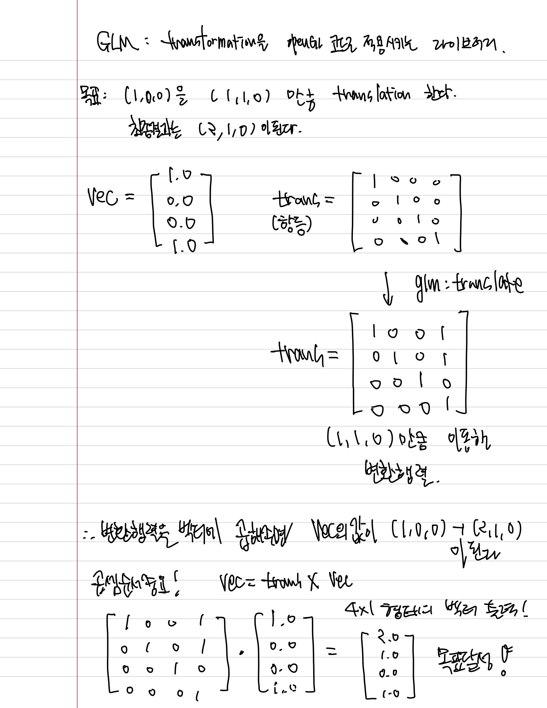
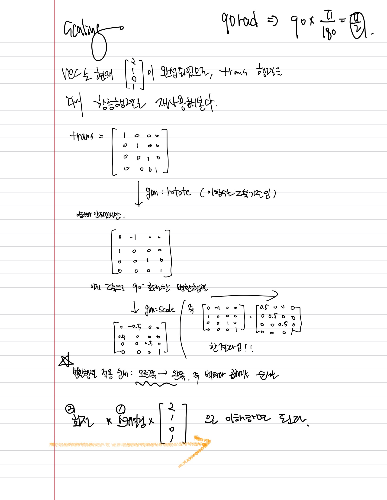

# GLM

GLM라이브러리는 tranformation을 openGL코드로 적용시킬 수 있도록 도와주는 라이브러리이다.
이번 장에서는 (1,0,0)을 (1,1,0)만큼 translation 해보고 회전시키는것 까지 해보도록 한다.  
처음에는 translation에 관한 내용이다.

```cpp
glm::vec4 vec(1.0f, 0.0f, 0.0f, 1.0f);
glm::mat4 trans = glm::mat4(1.0f);
trans = glm::translate(trans, glm::vec3(1.0f, 1.0f, 0.0f));
vec = trans * vec;
std::cout << vec.x << vec.y << vec.z << std::endl;
```
첫 줄부터 설명하자면,  
glm에 내장되어있는 vec4클래스를 꺼내와서 vec이라는 이름의 변수를 정의한것이다. (1,0,0) 인데 동차좌표로 표현하면 (1,0,0,1)로 나타내기에 저렇게 쓴것이다.  **vec는 열벡터로 나타내어진다.**  

다음문장은 4X4형태의 항등행렬을 생성한 코드인데, mat4에 1.0f를 넣으면 항등행렬(identity matrix)가 나온다. 즉, trans 변수는 처음에 변환이 없는 항등행렬로 초기화된다.

처음에 항등행렬로 설정한 trans행렬은 이동(translation)을 위해서 gl::translate함수에 넣어준다. 그렇다면 행렬 trans는 (1,1,0)만큼 이동(translation) 한 행렬로 변한다.  

이렇게 만든 두개의 행렬 vec과 trans행렬은 서로 곱해준다면? 이전에 배운 이동의 행렬계산을 직접 할 수있게 된다.




다음에는 scaling 을 수행한 코드를 보도록 하자.  
```cpp
glm::mat4 transform = glm::mat4(1.0f);
transform = glm::rotate(transform, glm::radians(90.0f), glm::vec3(0.0, 0.0, 1.0));
transform = glm::scale(transform, glm::vec3(0.5, 0.5, 0.5));
```  



다음은 이 변환된 매트릭스를 셰이더 코드를 통해 전달해야한다.
유니폼 변수를 활용, 이 행렬을 버텍스셰이더에서 선언하여 전달한 후 포지션 벡터에 적용한다.

```cpp
#version 330 core
layout (location = 0) in vec3 aPos;
layout (location = 1) in vec2 aTexCoord;

out vec2 TexCoord;
  
uniform mat4 transform;

void main()
{
    gl_Position = transform * vec4(aPos, 1.0f);
    TexCoord = vec2(aTexCoord.x, aTexCoord.y);
}
```
## 코드설명  
입력변수로 2개 3d 정점데이터 (vec3 aPos: 3D 좌표 (x, y, z)), 2d 텍스처 (vec2 aTexCoord: 2D 텍스처 좌표 (u, v)) 좌표 데이터를 받는다.  
출력변수로는 TexCoord는 프래그먼트 쉐이더로 넘길 텍스처 좌표, 유니폼 변수로는 mat4 transform: 4x4 변환 행렬 (모델 변환, 회전, 스케일링 등 포함)를 받는다.
메인함수로는 gl_position을 이용해 vec3에서 vec4로 형변환을 해주었고, 거기에 transform 행렬을 곱해서 변환(이동, 회전, 스케일링) 적용하여 gl_Position에 최종 좌표 저장한다.

유니폼 변수 transform은 우리가 셰이더에 전달해주는 변환행렬이다. (즉 좀 전에는 trans라고만 변환행렬 변수를 지어줬던건 설명하기 쉬우라고 그렇게 지었던 것이고, 실제로는 transform이라고 변환행렬 변수명을 소스코드에 지었을 것이다.)

이후 텍스처 좌표값은 그대로 변화없이 출력변수로 나가고, 프래그먼트 셰이더에 들어가게 된다.
이후 opengl코드에서도 행렬을 셰이더에 전달하는 코드를 작성해줘야 한다.

```cpp
unsigned int transformLoc = glGetUniformLocation(ourShader.ID, "transform");
glUniformMatrix4fv(transformLoc, 1, GL_FALSE, glm::value_ptr(transform));
```

glGetUniformLocation 으로 유니폼 변수의 위치를 알아내고,  glUniformMatrix4fv 함수를 가지고 행렬정보를 셰이더에 전달해 준다,


transformLoc: 첫 번째 인자는 유니폼 변수 transform의 위치입니다. 이 값은 glGetUniformLocation() 함수에서 가져온 값.

1: 두 번째 인자는 행렬의 개수입니다. 여기서 1은 하나의 행렬만 전달한다는 의미.

GL_FALSE: 세 번째 인자는 행렬이 전치(transpose)되지 않았음을 의미합니다. OpenGL에서는 기본적으로 행렬이 전치되지 않으므로 GL_FALSE를 사용한다.

glm::value_ptr(trans): 네 번째 인자는 행렬 데이터를 포인터로 전달하는 부분입니다. glm::value_ptr()는 glm::mat4 타입의 행렬을 C 스타일 포인터로 변환해줘서 OpenGL에 전달할 수 있게 해준다. 여기서 trans는 변환 행렬이다.


```cpp
glm::mat4 transform = glm::mat4(1.0f);
transform = glm::translate(transform, glm::vec3(0.5f, -0.5f, 0.0f));
transform = glm::rotate(transform, (float)glfwGetTime(), glm::vec3(0.0f, 0.0f, 1.0f));
```
코드를 하나 더 추가했다. 회전하는 코드를 추가한 것인데,  rotate함수의 두번째 인수가 회전각(angle)을 의미한다. 세번째 인수는 z축으로 회전함을 말함. 즉 시간이 흐를수록 그에 비례하는만큼 z축으로 회전한다.

<video controls src="images/transformations.mp4" title="Title"></video>