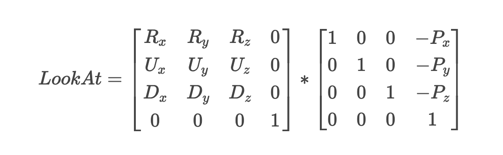

# 카메라의 정의와 생성

- [카메라의 정의와 생성](#카메라의-정의와-생성)
- [Camera](#camera)
	- [카메라 위치](#카메라-위치)
	- [카메라 방향](#카메라-방향)
	- [카메라 right \& up axis(vec)](#카메라-right--up-axisvec)
	- [LookAt](#lookat)
	- [카메라 회전](#카메라-회전)
		- [glm::lookAt](#glmlookat)

# Camera
카메라를 정의하기 위해서는 `월드좌표에서의 카메라 위치`, `카메라의 방향`, `카메라의 right,up vector`가 필요하다.

  

## 카메라 위치
`카메라 위치(position)`는 월드 공간에서 카메라의 위치 벡터를 설정해주면 된다. 저번에는 scene을 z축의 음의 방향으로 하여 멀어지게 하는 방법을 썼고, 이번에는 카메라를 기준으로 하여 카메라가 
z축의 양의 방향(즉 사용자 방향)으로 가게 만든다.

```cpp
glm::vec3 cameraPos = glm::vec3(0.0f, 0.0f, 3.0f);
```

## 카메라 방향
카메라 방향(direction)은 백터의 뺄셈 개념이 들어가있는데,  일단 카메라가 원점을 바라본다고 가정하고 설명하자면, 원점에서 카메라의 위치 vec를 빼주면 된다. 이는 z축의 양의 방향이 사용자 방향이기 때문에 뺄셈 계산 순서를 잘 생각하여야 한다. 

```cpp
glm::vec3 cameraTarget = glm::vec3(0.0f, 0.0f, 0.0f);
glm::vec3 cameraDirection = glm::normalize(cameraPos - cameraTarget);
```

## 카메라 right & up axis(vec)
right,up 은 오른손 좌표계로 따지면 x축과 y축을 의미하는 것이다. 
right 벡터를 구하는것은 간단하다. up벡터를 (0,1,0)으로 지정하고 이 벡터와 카메라의 방향 벡터(cameraDirection)와의 외적을 구하면 그게 right 벡터가 된다.

```cpp
glm::vec3 up = glm::vec3(0.0f, 1.0f, 0.0f); 
glm::vec3 cameraRight = glm::normalize(glm::cross(up, cameraDirection));
```

다음으로 up벡터는 앞에서 구한 방향벡터와 right벡터의 외적이다. 
```cpp
glm::vec3 cameraUp = glm::cross(cameraDirection, cameraRight);
```


## LookAt
앞서 보았던 4개의 벡터(위치,방향,업,라이트)들을 이용하여 보자.
  
`(여기서 R은 오른쪽 벡터, U는 위쪽 벡터, D는 방향 벡터, P는 카메라의 위치 벡터)`

서로 수직관계인 3개의 축 up,right,direction 벡터를 가지고 새로운 좌표 공간을 정의할 수 있고, 이 3개의 축과 이동 행렬(translation mat)를 이용하면 모든 벡터에 대해 새롭게 정의한 좌표공간의 벡터로 새롭게 변환할 수 있다.

그렇다면 새롭게 정의한 좌표공간(R,U,D)을 camera space라고 하고, 이 3개의 축과 camera position vector인 P를 이용하여, 위에서 말한 새로운 벡터로 바꾸어주는 LookAt 행렬을 만들 수 있다.  
이를 통해 World space의 좌표를 Camera space의 좌표로 변환할 수 있는 것이다.

이런 LookAt행렬을 View행렬로 사용할 수있고, 결국 World space를 View Space로 변환 할 수있다.
또한 GLM라이브러리가 이 모든 작업을 대신 수행해주므로, 우리는 그냥 3개의 축에 대한 정보를 함수에 넣어주기만 하면 된다.

```cpp
glm::mat4 view;

view = glm::lookAt(
	   glm::vec3(0.0f, 0.0f, 3.0f), 
  	   glm::vec3(0.0f, 0.0f, 0.0f), 
  	   glm::vec3(0.0f, 1.0f, 0.0f)
	   );
```

`glm::LookAt` 함수는 각각 위치, 타겟 및 업 벡터를 필요로 하고, 이 예제는 이전 장에서 만든 것과 동일한 뷰 행렬을 만든다.


## 카메라 회전

<video controls>
	<source src="https://learnopengl.com/video/getting-started/camera_circle.mp4" type="video/mp4">
</video>


```cpp
// 원의 반지름을 설정 (카메라가 원형 경로를 따라 이동)
const float radius = 10.0f;

// 카메라의 x 좌표 계산: 시간을 기준으로 sin 함수 값에 반지름을 곱하여 x축을 따라 이동
float camX = sin(glfwGetTime()) * radius;

// 카메라의 z 좌표 계산: 시간을 기준으로 cos 함수 값에 반지름을 곱하여 z축을 따라 이동
float camZ = cos(glfwGetTime()) * radius;

// 뷰 행렬을 선언
glm::mat4 view;

// glm::lookAt 함수는 카메라의 시점을 정의하는 행렬을 생성
// 첫 번째 인자: 카메라 위치 (Pos) - 현재 camX, camZ에 해당하는 (x, 0, z) 위치
// 두 번째 인자: 카메라가 바라보는 지점 (Target) - 원점 (0.0f, 0.0f, 0.0f)을 바라봄
// 세 번째 인자: 카메라의 위쪽 방향 (Up) - y축을 위쪽으로 정의
view = glm::lookAt(glm::vec3(camX, 0.0f, camZ), glm::vec3(0.0f, 0.0f, 0.0f), glm::vec3(0.0f, 1.0f, 0.0f));
```

lookat함수의 매개변수는 차례로 position, target, up 순임을 기억하자.  
xz 평면에서 원점을 중심으로 회전하면서 y축이 항상 카메라의 위쪽 방향으로 고정된다.  

### glm::lookAt

`glm::mat4 glm::lookAt(const glm::vec3 &eye, const glm::vec3 &center, const glm::vec3 &up)`

```
첫 번째 인자: 카메라의 위치, (camX, 0.0f, camZ)로, 카메라가 원형 경로를 따라 움직인다.  

두 번째 인자: 카메라가 바라보는 중심점을 원점 (0.0f, 0.0f, 0.0f)로 설정한다.  

세 번째 인자: 카메라의 위쪽 벡터를 y축 (0.0f, 1.0f, 0.0f)로 설정하여, 카메라의 위쪽이 항상 y축을 따라 향하도록 한다.  
```


